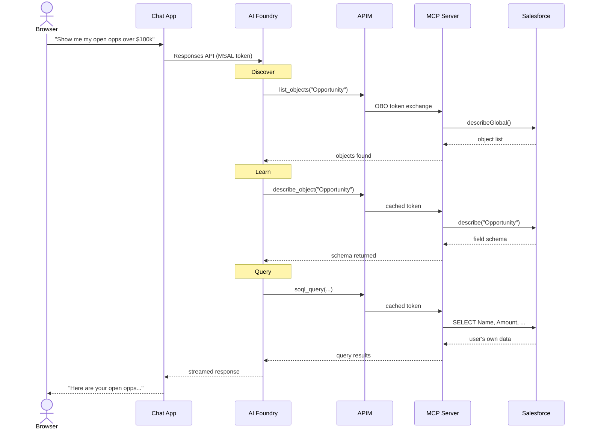
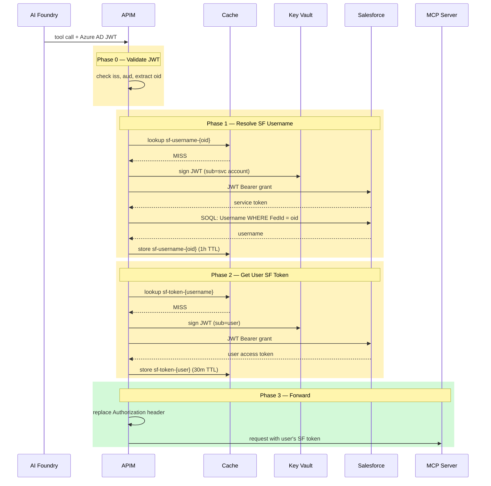
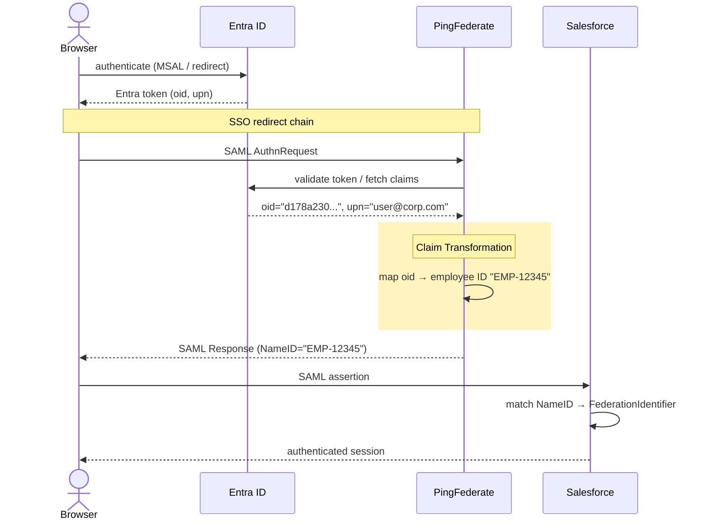
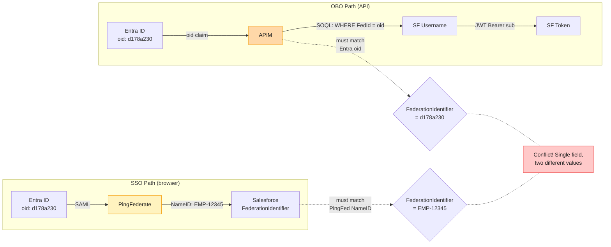

# Deep Dive

Detailed technical content for the [Salesforce Meta-Tool: Identity Propagation](../README.md) project.

---

## Token Claim Glossary

These terms appear throughout the docs. Understanding the difference prevents the most common debugging confusion.

| Term | Source | Value | Used for |
|------|--------|-------|----------|
| Azure AD `oid` | Entra ID JWT | `d178a230-d9c1-...` (GUID) | Immutable user ID, same across all apps in the tenant. Default `IdentityClaimName` for OBO lookup. |
| Azure AD `sub` | Entra ID JWT | `a1b2c3d4-...` (GUID) | Pairwise — different per app registration. Do NOT use for cross-app identity mapping. |
| `preferred_username` | Entra ID JWT | `user@company.com` | User's UPN or email. Mutable — can change on name/domain change. Use with caution. |
| SF `FederationIdentifier` | Salesforce User record | Whatever the upstream IdP sends | Single field that links an external identity to a SF user. Must be unique per org. |
| SF JWT Bearer `sub` | JWT assertion payload | SF Username (e.g., `user@myorg.com`) | Must be the Salesforce Username — NOT the FederationIdentifier. This is the most common mistake. |

**Key insight:** The APIM OBO policy bridges two identity spaces: it uses `FederationIdentifier` (matched via `oid`) to *find* the SF Username, then uses that Username as `sub` in the JWT Bearer assertion. These are two separate values serving two different purposes.

---

## The Meta-Tool Pattern

Most Salesforce MCP servers define one tool per object (`get_accounts`, `get_opportunities`, ...). That approach doesn't scale: an org with 100 custom objects needs 100 tools.

This project uses a different pattern, borrowed from how Claude Code works:

```
Developer World                    Enterprise World
-----------------                  -----------------
Bash (meta-tool)          ->       Salesforce MCP Server (meta-tool)
  +- git, npm, docker                +- list, describe, query, search, write, approve
     kubectl, terraform                 covers any object, any field, any workflow
```

**Bash doesn't implement git.** It delegates to git. The agent builds the command.
**This MCP server doesn't implement CRM logic.** It delegates to Salesforce. The agent builds the query.

### How the Agent Thinks

The user asks: *"Show me my open opportunities worth over $100k"*

1. **Identity.** `whoami()` — resolves the bearer token to a Salesforce UserId (`005...`).
2. **Discover.** `list_objects(filter="Opportunity")` — finds the object and its CRUD flags.
3. **Learn.** `describe_object("Opportunity")` — gets every field: `Name`, `Amount`, `StageName` (with picklist values), `IsClosed`, and 60+ more.
4. **Query.** Builds SOQL from the schema:
   ```sql
   SELECT Name, Amount, StageName, CloseDate, Account.Name
   FROM Opportunity
   WHERE OwnerId = '005...' AND Amount > 100000 AND IsClosed = false
   ORDER BY Amount DESC
   ```
5. **Execute.** `soql_query(...)` returns *the user's own data*, filtered by their sharing rules and field-level security. A sales rep sees their pipeline. A VP sees the full forecast. Same query, different results.

### Why This Scales

The tool surface is **fixed**: seven tools, ~1,300 tokens. Whether the org has 50 objects or 5,000, the MCP server definition doesn't change.

| Approach | Token cost | Coverage |
|----------|------------|----------|
| Full OpenAPI spec | 5,000-15,000 | Hundreds of endpoints, most irrelevant |
| RAG documentation chunks | 2,000-10,000 | Partial, depends on retrieval quality |
| One tool per object | ~500 x N objects | Scales linearly, N can be 100+ |
| **This MCP server** | **~1,300 fixed** | **All objects, all fields, all operations** |

---

## Tool Reference

**`whoami`**: Identity resolver. Returns the current user's Salesforce identity (user_id, username, name, email, organization_id) from the bearer token. The agent calls this when the user refers to "my" records, then uses the user_id as OwnerId or CreatedById in SOQL WHERE clauses. Think `whoami`.

**`list_objects`**: Entry point. Filters by name or label to find the right object among 1,000+. Returns name, label, and CRUD capability flags. Think `ls`.

**`describe_object`**: Schema inspector. Returns every field with its API name, data type, required flag, picklist values, relationships, and external ID flags. The agent calls this *before* writing. Think `man`.

**`soql_query`**: Precision read tool. Supports the full SOQL syntax: relationship queries, aggregates, `GROUP BY`, `HAVING`, date functions, subqueries. Auto-paginates at Salesforce's 2,000-record limit. Think `SQL`.

**`search_records`**: Discovery tool. SOSL full-text search across multiple objects simultaneously, useful when the agent doesn't know *which* object contains the data. Think `rg`.

**`write_record`**: Mutation tool. Four operations: `create`, `update`, `upsert` (by external ID), `delete`. Validates field names against the schema before calling the API, catches typos before they reach Salesforce. Think `echo >` or `rm`.

**`process_approval`**: Workflow tool. Submit records for approval, approve or reject pending work items. Integrates with Salesforce's built-in approval workflows. Think `git push`, a governed state transition.

---

## Identity Propagation: End-to-End

<table><tr>
<td></td>
<td></td>
</tr></table>

### The Problem

The most common enterprise MCP pattern connects via a service account:

```
User -> Agent -> Service Account -> Salesforce
                      ^
          Admin access. Sees ALL data. Bypasses sharing rules.
          "List all opportunities" returns the entire pipeline.
```

This project propagates the user's own identity through every layer. The Salesforce API enforces the same CRUD permissions, field-level security, sharing rules, and approval workflows that apply when the user logs into the Salesforce UI directly.

**The agent becomes a power tool, not a privileged backdoor.**

### Architecture

```
User (browser)
  |
  +-[MSAL.js]--> Azure AD --> token(aud=AzureML, appid=ChatApp)
  |                                |
  |                                v
  +--------------------------> AI Foundry (Responses API)
                                   |
                                   +-[UserEntraToken]--> Azure AD --> token(aud=MCP-Gateway)
                                   |                                        |
                                   |                                        v
                                   +--------------------------------------> APIM (validate-jwt)
                                                                           |
                                                                     [Three-phase exchange]
                                                                           |
                                                                           v
                                                                     SF MCP Server
                                                                           |
                                                                           v
                                                                     Salesforce API
```

### Every Hop, Every Token

Here is what happens when a user sends a message, traced through every authentication boundary:

**1. User signs in.** MSAL.js acquires an Azure AD token (`aud=AzureML`, claims include `oid` and `upn`). The `oid` (object ID) is the user's immutable identity across all Azure AD apps in the tenant.

**2. Chat App forwards to AI Foundry.** The Chat App passes the user's token to AI Foundry via `UserTokenCredential`. Foundry preserves the user's identity (`oid`, `upn`) through its internal OBO-like exchange.

**3. Foundry acquires an APIM-audience token.** Foundry's OAuth client acquires a separate token scoped to the MCP Gateway audience (`aud=https://ai.azure.com`). The user's `oid` and `upn` claims are carried forward.

**4. APIM validates the Azure AD JWT.** The `validate-jwt` policy checks the token against both v1 (`sts.windows.net`) and v2 (`login.microsoftonline.com`) issuers and the expected audience. The user's `oid` is extracted.

**5. APIM resolves the Salesforce username.** APIM checks its cache for `sf-username-{oid}`. On miss: a service account token runs `SELECT Username FROM User WHERE FederationIdentifier = '{oid}'` against Salesforce. The result is cached for 1 hour.

> **Why `oid` and not `sub`?** The `sub` claim is pairwise: it changes per app registration. `oid` is the same across all apps in the tenant, making it a stable identity anchor for the `FederationIdentifier` mapping.

**6. APIM gets the user's Salesforce token.** APIM checks its cache for `sf-token-{username}`. On miss: it creates a JWT Bearer assertion with `sub` = the Salesforce username, signs it with a Key Vault certificate, and exchanges it at the Salesforce token endpoint. The result is cached for 30 minutes.

**7. APIM forwards with the Salesforce token.** The original `Authorization` header is replaced with the user's Salesforce access token. The request continues to the MCP backend.

**8. MCP server extracts the token.** The entire identity propagation logic on the MCP side is seven lines:

```python
class BearerTokenMiddleware(BaseHTTPMiddleware):
    async def dispatch(self, request, call_next):
        auth = request.headers.get("authorization", "")
        token = auth[7:] if auth.lower().startswith("bearer ") else None
        tok = _request_token.set(token)
        try:
            return await call_next(request)
        finally:
            _request_token.reset(tok)
```

**9. Salesforce enforces the user's own permissions.** Every API call runs as the mapped user. CRUD permissions, field-level security, sharing rules, and approval workflows all apply. A sales rep sees their pipeline. An admin sees everything. Same MCP server, different results.

### Caching and Performance

Three cache layers keep warm requests at ~0ms overhead:

| Cache key | TTL | What it stores |
|-----------|-----|---------------|
| `sf-service-token` | 30 min | Service account token for SOQL user lookups |
| `sf-username-{oid}` | 1 hour | Azure AD `oid` -> Salesforce username mapping |
| `sf-token-{username}` | 30 min | Per-user Salesforce access token |

On a 401 from Salesforce, APIM automatically evicts the cached user token. The next request re-exchanges transparently.

### Key Guarantees

- **No token stored.** The MCP server never persists, caches, or refreshes tokens. It reads the `Authorization` header and forwards it. Stateless.
- **No scope escalation.** The Salesforce token is scoped to the mapped user. APIM cannot mint a token with broader permissions than the user has in Salesforce.
- **Per-user audit trail.** Every Salesforce API call is logged under the user's own identity. The admin audit log shows *who* did *what*, not "the service account did everything."
- **Stateless MCP server.** No session state, no token cache, no user database. The server can be replaced, scaled, or restarted without affecting any user's session.

### What It Does Not Protect Against

Identity propagation prevents privilege escalation: the agent can't do more than the user. It does not prevent the agent from misunderstanding intent. For production use, treat destructive operations with the same care you'd apply to any irreversible action: confirmation prompts, audit logging, and appropriate permission scoping in Salesforce.

---

## IdP Flexibility

The On-Behalf-Of (OBO) architecture is not locked to Azure AD. The `IdentityClaimName` Named Value (default: `oid`) controls which JWT claim is used for user identity. To switch to another IdP:

| What changes | Where | Notes |
|---|---|---|
| OIDC discovery URL | `sf-mcp-obo-policy.xml` | Point to PingFed, Okta, or other OIDC endpoint |
| Issuer validation | `sf-mcp-obo-policy.xml` | Update to new issuer(s) |
| Identity claim name | `IDENTITY_CLAIM_NAME` env var | `oid` -> `sub` or a custom claim |
| Audience | `sf-mcp-obo-policy.xml` | Match IdP configuration |
| Foundry connection type | `sf-obo-connection.bicep` | `UserEntraToken` is Azure-only; other IdPs need `CustomKeys` |

The MCP server and Salesforce Connected App configuration remain unchanged. Only the APIM policy and Foundry connection need updating.

---

## Chained Federation: Multi-IdP Scenarios

In many enterprises, Salesforce SSO isn't federated directly with Entra ID. Instead, an SSO hub like PingFederate or Okta sits between them. This section explains how the identity propagation pattern works in those environments.

### The Universal "Join Key" Concept

Every IdP has a stable identifier that can serve as the join key to Salesforce's `FederationIdentifier` field:

| IdP | Stable identifier | Typical value | Notes |
|-----|-------------------|---------------|-------|
| Entra ID | `oid` | `d178a230-d9c1-...` | Immutable across all apps in the tenant |
| PingFederate | `NameID` (SAML) or `sub` (OIDC) | Configurable -- often UPN or employee ID | PingFed controls what gets emitted |
| Okta | `externalId` / `sub` | `00u1abc...` or UPN | Depends on Okta Universal Directory config |
| Salesforce | `FederationIdentifier` | Whatever the upstream IdP sends | Must be unique per org; matched during SSO |

The principle is always the same: **one stable claim from the IdP must match one field in Salesforce**. The question is which claim, and whether it survives transformation through intermediate IdPs.

### Pattern 1: Direct Federation

One IdP federates directly with Salesforce. The identity claim flows straight through.

```
Entra ID --[SAML/OIDC]--> Salesforce
  oid = "d178a230..."         FederationIdentifier = "d178a230..."
```

Whatever claim the IdP emits as `NameID` (SAML) or `sub` (OIDC) must match the SF user's `FederationIdentifier`. No transformation layer, no ambiguity.

### Pattern 2: Chained Federation (SSO Hub)

PingFederate (or Okta) acts as the SSO hub. Entra ID authenticates the user, but PingFed transforms claims before passing them to Salesforce.

```
Entra ID --[SAML]--> PingFederate --[SAML]--> Salesforce
  oid: "d178a230..."    NameID: ???              FederationIdentifier: ???
```

PingFederate is a **claim transformation layer**. It receives claims from Entra ID and can:

- **Pass through** the Entra `oid` as-is -- FederationIdentifier stores the oid
- **Map** to a different attribute (email, employee ID, custom) -- FederationIdentifier stores that
- **Enrich** from another source (LDAP, database lookup) -- FederationIdentifier stores the enriched value

The admin configures this in PingFed's **Authentication Source Mapping > Attribute Contract Fulfillment**. Whatever PingFed puts in `SAML_SUBJECT` is what Salesforce matches against `FederationIdentifier`.

### The FederationIdentifier Conflict

When SSO and API access (OBO) use different IdP paths, the `FederationIdentifier` can only hold one value. This creates a conflict:

| Path | Claim source | Claim value | FederationIdentifier must be... |
|------|-------------|-------------|-------------------------------|
| SSO (browser) | PingFed NameID | `EMP-12345` (employee ID) | `EMP-12345` |
| OBO (API) | Entra ID oid | `d178a230-d9c1-...` | `d178a230-d9c1-...` |

Both paths need to resolve to the same Salesforce user, but `FederationIdentifier` is a single field.

### Three Solutions

**Solution A -- Align on a common claim.** Configure PingFed to pass through the Entra ID `oid` unchanged. Both SSO and OBO use the same value. Simplest, but requires PingFed configuration change.

**Solution B -- Custom Salesforce field.** Keep `FederationIdentifier` for SSO. Add a custom field (e.g., `EntraOid__c`) for OBO lookup. Change the APIM SOQL query to:

```sql
SELECT Username FROM User WHERE EntraOid__c = '{oid}' AND IsActive = true LIMIT 1
```

No PingFed change required, but adds a custom field to manage.

**Solution C -- Match on shared attribute.** Use `email` or `upn` as the common anchor. Both PingFed and the OBO flow include email/UPN. Change the APIM policy to use `preferred_username` instead of `oid`:

```
IDENTITY_CLAIM_NAME = preferred_username
```

And match against the SF User's `Email` or `Username` field. Risk: email is mutable and less stable than `oid`.

### Why OBO Bypasses SSO

The three-phase OBO exchange in APIM does **not** use SSO federation at all. The JWT Bearer flow requires `sub` = Salesforce Username (not FederationIdentifier). The `FederationIdentifier` is only used as a SOQL lookup key to find the Username:

```
Azure AD oid --[SOQL lookup]--> SF Username --[JWT Bearer sub]--> SF Token
```

| Step | SSO (browser login) | OBO (this project) |
|------|--------------------|--------------------|
| Who issues the token? | PingFed (after delegating to Entra) | Entra ID directly (MSAL in chat app) |
| What claim identifies the user? | PingFed's `NameID` | Entra `oid` |
| What does SF match against? | `FederationIdentifier` | `FederationIdentifier` (via APIM SOQL) |
| How does the user get a SF session? | SAML assertion | JWT Bearer (`sub` = Username) |

This means:

1. **SSO can use any IdP chain** (PingFed, Okta, direct) with any claim mapping
2. **OBO is independent** -- it only needs `FederationIdentifier` (or a custom field) set to the Entra ID `oid`
3. **No conflict** if Solution A or B is used -- SSO and OBO coexist as long as the lookup field is consistent

---

## Certificate Rotation

The X.509 certificate used for JWT Bearer signing has a default validity of 365 days. Plan for rotation before expiry.

### When to Rotate

- **Scheduled:** Before the cert expires (check `openssl x509 -in certs/sf-jwt-bearer.crt -noout -enddate`).
- **Unscheduled:** If the private key is compromised or the cert is revoked.

### Rotation Steps (Zero-Downtime)

1. **Generate a new certificate** (same commands as [Phase 1](installation.md#phase-1-generate-x509-certificate)):
   ```bash
   openssl genrsa -out certs/sf-jwt-bearer-new.key 2048
   openssl req -new -x509 -key certs/sf-jwt-bearer-new.key \
     -out certs/sf-jwt-bearer-new.crt -days 365 \
     -subj "/CN=SalesforceJWTBearer"
   openssl pkcs12 -export -out certs/sf-jwt-bearer-new.pfx \
     -inkey certs/sf-jwt-bearer-new.key -in certs/sf-jwt-bearer-new.crt \
     -passout pass:
   ```

2. **Upload new cert to Salesforce Connected App.** Go to Setup > App Manager > your Connected App > Edit. Under "Use digital signatures," upload `sf-jwt-bearer-new.crt`. Salesforce accepts multiple certificates — the old one still works until you remove it.

3. **Upload new PFX to Azure Key Vault.** The postprovision hook handles this, but you can also do it manually:
   ```bash
   az keyvault certificate import --vault-name <kv-name> \
     --name sf-jwt-bearer --file certs/sf-jwt-bearer-new.pfx
   ```
   Key Vault versions the certificate. The new version is active immediately.

4. **Update APIM certificate thumbprint.** The new cert has a different thumbprint:
   ```bash
   # Get new thumbprint
   openssl x509 -in certs/sf-jwt-bearer-new.crt -noout -fingerprint -sha1 \
     | sed 's/://g' | cut -d= -f2

   # Update azd env and APIM Named Value
   azd env set SF_JWT_BEARER_CERT_THUMBPRINT "<new-thumbprint>"
   azd up   # or re-run postprovision hook
   ```

5. **Verify.** Send a message through the Chat App. Check Salesforce Login History for a successful "Connected App" login. If it works, remove the old cert from the Salesforce Connected App.

6. **Replace local files:**
   ```bash
   mv certs/sf-jwt-bearer-new.key certs/sf-jwt-bearer.key
   mv certs/sf-jwt-bearer-new.crt certs/sf-jwt-bearer.crt
   mv certs/sf-jwt-bearer-new.pfx certs/sf-jwt-bearer.pfx
   ```

### Rollback

If the new cert doesn't work, the old cert is still in Salesforce and the previous Key Vault version can be restored:
```bash
az keyvault certificate list-versions --vault-name <kv-name> --name sf-jwt-bearer
```

---

## Sub-Agent Pattern: Context Isolation

### The Problem

A single AI Foundry prompt agent accumulates every tool call result in its thread.  Schema discovery calls (`list_objects`, `describe_object`), intermediate SOQL attempts, and error responses all stay in the context permanently — consuming tokens and introducing noise into subsequent reasoning steps.

### The Pattern

The sub-agent pattern delegates discrete, bounded tasks to a **fresh agent thread**.  The parent receives only the distilled text answer; all intermediate tool calls stay in the sub-agent's isolated context and never pollute the parent thread.

```
Parent Thread                    Sub-Agent Thread (isolated)
──────────────                   ───────────────────────────
User: "What are my open cases?"  Task: "Find the API name for support cases
  → call_sub_agent(task)               and list their key fields"
  ← "Object: Case. Fields: …"     → list_objects(filter="case")
                                   → describe_object("Case", mode="slim")
                                   ← "Object: Case. Fields: Id, Subject, Status, …"
  → soql_query(built from answer)
```

### Implementation

`call_sub_agent` in `src/shared/foundry_helpers.py` handles this:

```python
from shared.foundry_helpers import call_sub_agent

schema_summary = await call_sub_agent(
    access_token=access_token,
    task="Find the Salesforce API name for support cases and list the 5 most important fields.",
    agent_name="salesforce-assistant",    # or a specialised schema-discovery agent
    depth=0,                              # 0 = called from the app layer
)
# schema_summary is plain text — only this string enters the parent thread
result = await call_agent(access_token, f"Using this schema: {schema_summary}\n\nNow answer: {user_question}")
```

### Self-Referencing Risks

Prompt agents can reference themselves as a tool if the agent name matches the tool catalog.  Without a guard, this creates an infinite delegation loop: agent A calls agent A, which calls agent A, consuming quota and compute.

The recursion guard is two-layered:

| Layer | Mechanism | Where |
|-------|-----------|-------|
| Application | `depth >= max_depth` check in `call_sub_agent` | `foundry_helpers.py` |
| Gateway | `X-Sub-Agent-Depth` header, capped at `{{MaxSubAgentDepth}}` Named Value | `agent-gateway-policy.xml` |

The header guard is the stronger of the two because it applies even when the sub-agent is invoked through a tool call that bypasses the Python layer.

### Recursion Guard: How It Works

1. Every call through the agent gateway reads `X-Sub-Agent-Depth` from the incoming request (defaults to `0`).
2. If `depth >= MaxSubAgentDepth`, APIM returns `429` before the request reaches Foundry.
3. Otherwise APIM increments the header and forwards it.  The next hop sees the updated value.
4. `MaxSubAgentDepth` defaults to `1` (one level of sub-agents; sub-agents cannot delegate further).

To allow two-hop chains, set `MaxSubAgentDepth` to `2` in the APIM Named Value.  In practice, more than one hop rarely adds value and significantly increases latency and token cost.

---

## Behavioral Control via APIM: Runtime Agent Configuration

### Why Not Change the Agent Definition?

Maintaining separate agent variants for read-only, reporting, or restricted-delegation scenarios creates combinatorial drift: every change to the base agent must be replicated across all variants.  The goal is **one definition, multiple runtime modes** controlled at the infrastructure layer.

### The APIM Gateway Pattern

`infra/policies/agent-gateway-policy.xml` implements a control layer that rewrites the Responses API request body before it reaches Foundry.  No agent definition changes are required.

```
Chat App / Teams Bot
        │
        ▼
APIM agent-gateway (agent-gateway-policy.xml)
   ├── Read X-Agent-Mode header
   ├── Read X-Context-Flags header
   ├── Read X-Sub-Agent-Depth header
   ├── [strip tools if read-only or no-delegation]
   ├── [inject system turn if context flags present]
   └── [reject if depth >= MaxSubAgentDepth]
        │
        ▼
AI Foundry Responses API
```

### Available Controls

| Header | Values | Effect |
|--------|--------|--------|
| `X-Agent-Mode` | `read-only` | Strips `write_record` and `process_approval` from the tool list |
| `X-Agent-Mode` | `no-delegation` | Strips tools whose name starts with `delegate_` |
| `X-Agent-Mode` | `default` (or absent) | No tool stripping |
| `X-Context-Flags` | `key=value,key2=value2` | Prepends a system message turn with the flags |
| `X-Sub-Agent-Depth` | integer | Recursion counter; request rejected if ≥ `MaxSubAgentDepth` |

### Is `set-body` a Stable Pattern?

Yes, with one caveat.  APIM's `set-body` rewriting is fully supported for standard HTTP APIs.  The Foundry Responses API accepts JSON bodies.  Rewriting the `tools` array and prepending to `input` are both stable operations.

**Caveat:** APIM's `set-body` buffers the entire request body.  For very large tool catalogs this adds measurable latency (~10-50 ms for a 50 KB body).  For typical prompt-agent payloads (< 20 KB) the overhead is negligible.

### Failure Modes

| Scenario | Behaviour |
|----------|-----------|
| Malformed JSON body | `set-body` C# expression throws; APIM returns `500`.  Mitigate by wrapping in `try/catch` (already done in the policy). |
| Unknown `X-Agent-Mode` value | Policy falls through to the `default` branch — no tools stripped, request forwarded unchanged. |
| Foundry rejects rewritten body | Foundry returns `400` with a schema error.  The most common cause is an empty `tools` array when Foundry requires at least one tool.  Add a guard before stripping. |
| `MaxSubAgentDepth` Named Value missing | APIM fails to parse `int.Parse(...)` and returns `500`.  The Named Value is created by `apim-sf-mcp-obo.bicep` on `azd up`. |

---

## Context Compaction for Long Conversations

### The Problem

Every tool call result — field schemas, SOQL result sets, error messages — is appended to the thread and never pruned.  After 10–20 turns a Salesforce conversation can easily exceed 50,000 tokens, degrading response quality and increasing cost.

### Available Mechanisms

#### 1. `max_prompt_tokens` on a Run (Q3 — `truncation_strategy`)

Pass `max_prompt_tokens` to `call_agent` or in the `/api/chat` request body:

```json
POST /api/chat
{
  "access_token": "...",
  "message": "Show me open opportunities",
  "max_prompt_tokens": 20000
}
```

The Foundry runtime applies a `last_messages` truncation strategy: it drops the oldest messages until the prompt fits within the budget.  This keeps token cost predictable without any change to the agent definition.

**Scope:** `truncation_strategy` is scoped to the individual run.  It does **not** propagate to Connected Agent calls.  Each sub-agent call starts fresh and is not subject to the parent's truncation budget.

#### 2. Sub-agent isolation (incidental compaction)

By delegating schema-discovery tasks to sub-agents (see [Sub-Agent Pattern](#sub-agent-pattern-context-isolation)), the parent thread never sees raw field lists or large describe results — only the distilled summary.  This is the most effective compaction technique because it prevents context growth rather than reacting to it.

#### 3. Agent Framework compaction SDK

The `TruncationStrategy`, `SlidingWindowStrategy`, and `SummarizationStrategy` classes in the Azure AI Agents SDK apply to **in-memory (code-first) agents only**.  They do not apply to server-managed prompt agents defined in the Foundry portal.

For prompt agents, `max_prompt_tokens` on the run is the equivalent mechanism.

#### 4. Architectural pattern: periodic summarisation

For very long-running sessions, inject a periodic summarisation step at the application layer:

```
Every N turns (e.g. N=10):
  summary = await call_sub_agent(
      task="Summarise the conversation so far in ≤200 words.",
      ...
  )
  # Start a new conversation thread anchored to the summary,
  # discarding previous_response_id.
  previous_response_id = None
  message = f"[Session summary: {summary}]\n\n{new_user_message}"
```

This is the only way to prevent unbounded thread growth for prompt agents today.

---

## Meta-Tool Pattern: Ephemeral Lookup Results

### The Problem

`list_objects` and `describe_object` exist to answer momentary questions during query construction.  The agent needs a field list once to build a SOQL query; after that, the field list is context noise.  A typical `describe_object("Opportunity", mode="full")` response is 15–30 KB (hundreds of fields, picklist values, relationship metadata).  Left in the thread, this consumes 4,000–8,000 tokens for every subsequent turn.

### Pattern 1: Cheapest Mode First

The MCP server already provides three modes calibrated to information cost:

| Mode | Typical size | When to use |
|------|-------------|-------------|
| `names` | ~500 B | Field name validation only |
| `slim` | 2–5 KB | Query construction, relationship traversal |
| `full` | 15–30 KB | Before write/upsert/delete |

The server instructions already tell the agent to prefer `slim` for reads.  Enforcing mode discipline in the system prompt is the zero-infrastructure solution.

### Pattern 2: Result Compaction Middleware

The MCP server includes `ResultCompactionMiddleware`.  When the caller sends `X-Compact-Results: true`, oversized responses are automatically summarised before leaving the server — before they are written into the thread.

```
APIM (agent gateway)           MCP Server
      │                              │
      │  POST /tools/describe_object │
      │  X-Compact-Results: true     │
      ├─────────────────────────────▶│
      │                              │  describe_object() → 25 KB
      │                              │  [> COMPACT_THRESHOLD_BYTES]
      │                              │  compact → 4 KB (top 40 fields + overflow summary)
      │◀─────────────────────────────│
      │  4 KB JSON                   │
```

To enable, add `X-Compact-Results: true` to the APIM policy forwarded to the MCP backend.  Controlled by the `COMPACT_THRESHOLD_BYTES` environment variable (default: 8 192 bytes).

### Pattern 3: Sub-agent schema isolation

Delegate schema discovery entirely to a sub-agent:

```python
schema = await call_sub_agent(
    access_token=token,
    task="List the 10 most important fields on the Opportunity object for a sales pipeline query.",
)
# `schema` is a short plain-text summary (~200 tokens).
# The full describe_object result (4,000+ tokens) never enters the parent thread.
```

This is the most effective approach because the large result never exists in the parent context at all — only the agent's textual summary of it does.

### Pattern 4: Summarisation at the tool implementation layer

The tool itself can return a pre-summarised form.  The `describe_object` tool already does this:

- `mode="names"` returns a flat field-name list (no types, no metadata).
- `mode="slim"` omits picklist values and verbose label fields.

Adding a `mode="summary"` that returns a one-paragraph English description of the object and its key fields would be a natural extension.  Because the summary is generated at the server, it is never stored in its raw form anywhere in the thread.

### Comparison to RAG Retrieval Chunks

| Dimension | RAG chunks | Meta-tool results |
|-----------|-----------|------------------|
| Origin | Pre-indexed external corpus | Live API response |
| Size | Configurable (typically 200–500 tokens) | Variable (up to 8,000+ tokens) |
| Freshness | Stale until re-indexed | Always current |
| Mitigation | Chunk size, top-k limit, re-ranking | Mode selection, compaction middleware, sub-agent isolation |
| Thread permanence | Inserted once, never updated | Inserted on every call to the same tool |

The key difference is **per-turn accumulation**: RAG chunks are inserted once per query; meta-tool results can be inserted on every turn if the agent re-validates field names or re-discovers objects.  Sub-agent isolation addresses this by making schema discovery a one-shot operation in an isolated context.

---

## Current Scope and Limitations

This project is a proof of concept. Before using in production, consider:

- **Destructive operations**: There are no confirmation prompts or audit logs on `write_record` delete operations. Add guardrails appropriate to your org's governance requirements.
- **Token expiry mid-workflow**: APIM caches tokens for 30 minutes and auto-evicts on 401. Long-running workflows may need to retry.
- **Certificate rotation**: The Key Vault certificate used for JWT Bearer signing has a default expiry of 365 days. Plan for rotation.
- **Azure-specific infrastructure**: The deployment stack (APIM, AI Foundry, Container Apps) is Azure-native. Adapting this pattern to other clouds or self-hosted models requires replacing the infrastructure layer, though the [IdP flexibility](#idp-flexibility) section shows the authentication layer is modular.
- **Rate limits**: The Salesforce REST API has per-org API call limits. High-frequency agentic workflows should account for this.

---

## Diagram Sources

### Message Flow

> [Excalidraw source](diagrams/message-flow-sequence.excalidraw)



### OBO Token Exchange (detailed)

> [Excalidraw source](diagrams/obo-token-exchange.excalidraw)



### Chained Federation SSO Flow

> [Excalidraw source](diagrams/chained-federation-sso.excalidraw)



### Multi-IdP Identity Mapping

> [Excalidraw source](diagrams/multi-idp-identity-mapping.excalidraw)


